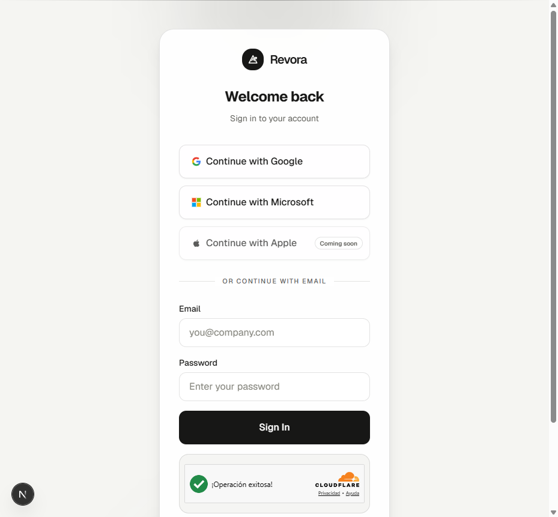
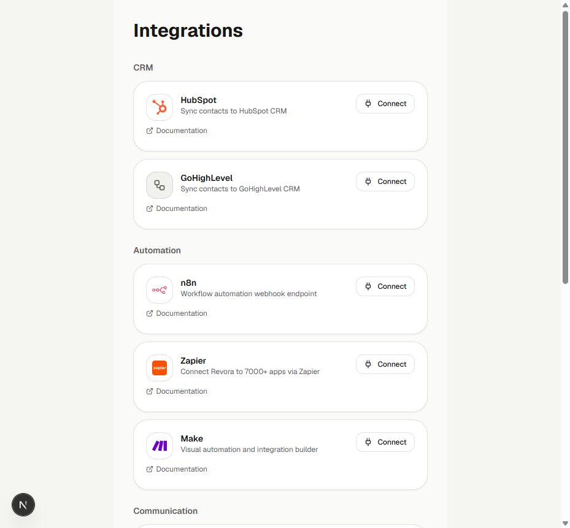
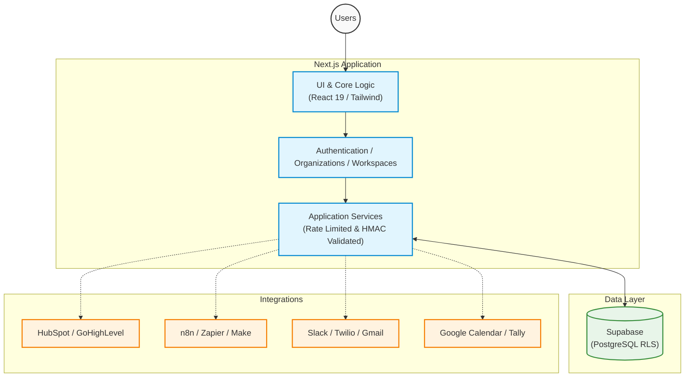

# Revora

Multi-tenant AI revenue automation platform built with Next.js, Supabase, and secure third-party integrations.

## Overview

Revora is an enterprise-grade SaaS application designed for AI-assisted lead management, qualification, and automated CRM workflows. It combines a high-performance public landing architecture with a strictly isolated multi-tenant organization dashboard.

## Core Capabilities

- **Lead Management & Pipeline:** Automated lead ingestion, visualization, and lifecycle tracking.
- **Automation Workflows:** Webhook-based trigger systems and execution retries.
- **CRM Integrations:** Bi-directional syncing with CRM systems.
- **Calendar & Communications:** Seamless scheduling and communication.
- **Multi-tenant Architecture:** Organization and workspace scoping with strict row-level security.
- **Secure Authentication:** MFA/TOTP, Turnstile bot protection, PKCE OAuth, and authenticated legal consents.

## Product Preview

### Authentication
Secure login with robust authentication methods and Cloudflare Turnstile protection.

### Integrations
Seamless multi-tenant connections to external CRMs, workflows, and automation tools.

## Architecture

## Security

- **Role-Based Access Control (RBAC):** Owner, Admin, Member constraints.
- **Row-Level Security (RLS):** Database isolation at the tenant level via Supabase.
- **Secrets Management:** Secure secret handling and strict separation of server/client keys.
- **OAuth & Tokens:** PKCE authentication and replay protection.
- **API Protection:** HMAC webhook verification and distributed rate limiting.
- **MFA:** Enforced TOTP multi-factor authentication and Cloudflare Turnstile integration.

## Quality

- 100% strict TypeScript.
- ESLint for static analysis.
- Integration contract tests validation.
- Automated UX validation.
- Production build validation.
- CI/CD quality gates via GitHub Actions.

## Tech Stack

- **Framework:** Next.js App Router (React 19)
- **Database:** Supabase PostgreSQL
- **Styling:** Tailwind CSS v4, Radix Primitives
- **Infrastructure:** Vercel, Supabase, Upstash Redis

## Local Development

1. Clone the repository
2. Run `npm install`
3. Copy `.env.example` to `.env` and fill the placeholder values
4. Run `npm run dev` to start the Next.js server on `localhost:3000`

## Technical Documentation

- [Architecture Overview](./ARCHITECTURE.md)
- [Provisioning Guide](./docs/PROVISIONING.md)
- [Observability](./docs/OBSERVABILITY.md)
- [Secrets Architecture](./docs/SECRETS_ARCHITECTURE.md)
- [Deployment Readiness](./docs/DEPLOYMENT_READINESS.md)
- [Backup and Recovery](./docs/BACKUP_RECOVERY.md)

## Contact / License

Private - All rights reserved.
